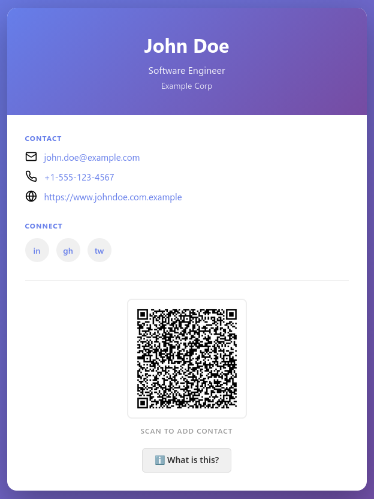

# Contact Card Static Page Generator

A Python-based static website generator that creates a beautiful, modern contact card HTML page from a JSON file with an embedded vCard QR code.

## Features

**Modern Design** - Clean, minimalist contact card with gradient header

**Responsive** - Works perfectly on desktop, tablet, and mobile devices

**vCard QR Code** - Scan with any phone to add contact to address book

**Embedded Assets** - Self-contained HTML files (no external images needed)

**Fast Generation** - Generates HTML in milliseconds

**Social Links** - Support for LinkedIn, GitHub, Twitter profiles

## Example Output



## Project Structure

```
bcard/
├── generate.py              # Main generator script
├── requirements.txt         # Python dependencies
├── README.md               # This file
├── input/
│   └── *.json              # One or more contact card inputs
├── output/
│   └── *.html              # Generated contact cards (output)
└── templates/
    └── card.html           # HTML template
```

## Setup

### 1. Install Dependencies

```bash
pip install -r requirements.txt
```

Requires:

- Python 3.6+
- `qrcode` - QR code generation
- `Pillow` - Image processing
- `Jinja2` - Template rendering

### 2. Configure Your Contact Card

Create one or more JSON files in `input/` with your details:

```json
{
  "name": "Your Name",
  "email": "your.email@example.com",
  "phone": "+1-555-0123",
  "company": "Your Company",
  "title": "Your Job Title",
  "website": "https://yourwebsite.com",
  "linkedin": "https://linkedin.com/in/yourprofile",
  "github": "https://github.com/yourprofile",
  "twitter": "https://twitter.com/yourhandle"
}
```

**Required fields:**

- `name` - Your full name

**Optional fields:**

- `email` - Email address
- `phone` - Phone number (any format)
- `company` - Company/Organization name
- `title` - Job title/position
- `website` - Personal or company website URL
- `linkedin` - LinkedIn profile URL
- `github` - GitHub profile URL
- `twitter` - Twitter profile URL

## Usage

### Generate Your Contact Cards

```bash
python generate.py
```

This will:

1. Read all JSON files from `input/`
2. Generate a vCard (standard contact format)
3. Create a QR code that encodes the vCard
4. Render the HTML template with all your information
5. Output a contact card per input file to `output/*.html`

### Output Naming

Each output filename is derived from the card `name` field using these rules:

- Lowercase all characters
- Remove special characters
- Convert spaces to underscores

If `name` is missing or empty, the input filename (without extension) is used instead.
If a filename already exists, a numeric suffix is appended (for example: `jane_doe-2.html`).

### View Your Contact Card

Open any generated `output/*.html` file in a web browser.

**Features you can interact with:**

- Click the "ℹ️ What is this?" button to learn about the QR code
- Hover over contact info to see interaction options
- Scan the QR code with any phone camera to add yourself as a contact
- Click social media links to visit profiles

## JSON Schema

### Field Reference

| Field | Type | Required | Example |
| --- | --- | --- | --- |
| `name` | string | Yes | "John Doe" |
| `email` | string | No | "john@example.com" |
| `phone` | string | No | "+1-555-0123" |
| `company` | string | No | "Acme Corp" |
| `title` | string | No | "Senior Engineer" |
| `website` | string | No | "https://example.com" |
| `linkedin` | string | No | "https://linkedin.com/in/johndoe" |
| `github` | string | No | "https://github.com/johndoe" |
| `twitter` | string | No | "https://twitter.com/johndoe" |

## QR Code

The generated QR code encodes your contact information in **vCard 3.0 format**, the standard used by smartphones for contact management.

**When someone scans the QR with their phone camera:**

- iOS: Prompts to add contact to Contacts app
- Android: Can import to Contacts app directly
- Other devices: Opens compatible contact import applications

The QR code includes all your contact fields and is generated at ~200x200px, providing good scanning reliability while remaining compact.

## Customization

### Styling

To customize the appearance, edit `templates/card.html` and modify the CSS in the `<style>` section:

- **Colors**: Look for `#667eea` (primary) and `#764ba2` (secondary)
- **Fonts**: Modify the `font-family` property
- **Layout**: Adjust padding, margins, and flex properties
- **Gradients**: Change the `linear-gradient` values

### Template Structure

The template uses **Jinja2** syntax. Variables you can use:

- `{{ name }}` - Contact name
- `{{ title }}` - Job title
- `{{ company }}` - Company name
- `{{ email }}` - Email address
- `{{ phone }}` - Phone number
- `{{ website }}` - Website URL
- `{{ linkedin }}` - LinkedIn URL
- `{{ github }}` - GitHub URL
- `{{ twitter }}` - Twitter URL
- `{{ qr_code }}` - QR code as data URI

## Output

Each generated `output/*.html` file is **completely self-contained**:

- All CSS is inline (no external stylesheets)
- QR code is embedded as a base64 data URI (no external image files)
- No external JavaScript libraries required
- Works offline - no internet connection needed after generation

This makes it perfect for:

- Emailing the HTML file directly
- Sharing via file transfer
- Hosting on any web server
- Using on a local filesystem

## Troubleshooting

### Error: "Required packages not found"

**Solution:** Install dependencies with `pip install -r requirements.txt`

### Error: "JSON file not found"

**Solution:** Make sure `input/business-card.json` exists and is in the correct location

### Error: "Invalid JSON"

**Solution:** Validate your JSON file - use a JSON validator or open it in a text editor to check for syntax errors

### QR code doesn't scan

**Solution:**

- Make sure contact data isn't too complex (keep it simple)
- Try scanning with different QR code reader apps
- The QR code is displayed on the HTML page - try taking a screenshot and scanning that

## Examples

See `input/business-card.json` for a complete example with all fields populated.

## License

This project is open source and available for personal and commercial use.

## Support

For issues or questions, check that:

1. Python 3.6+ is installed: `python --version`
2. All dependencies are installed: `pip install -r requirements.txt`
3. JSON file syntax is valid: use a JSON validator
4. File paths are correct and accessible
